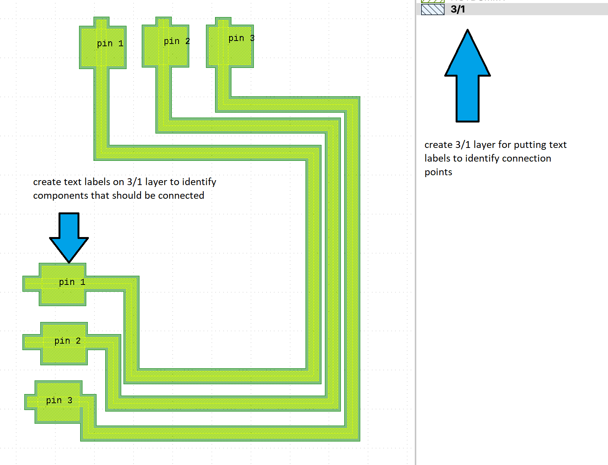
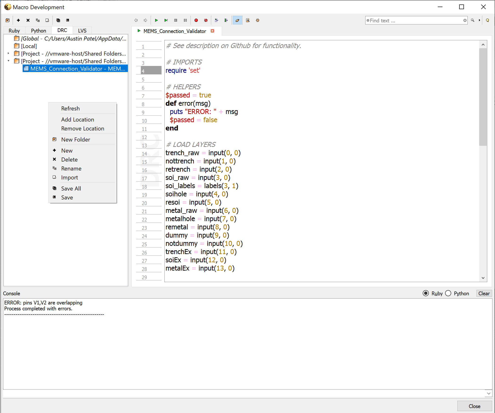
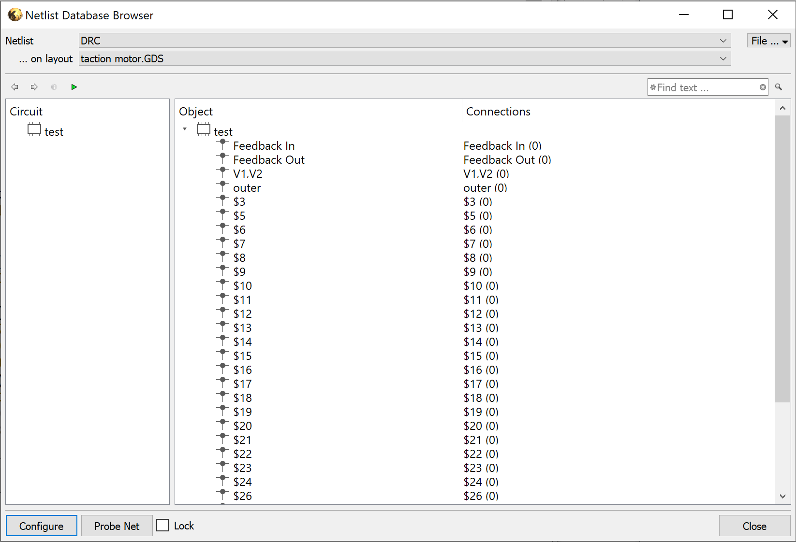

# KLayout Connection Validator
Uses KLayout DRC functionality to check for layout errors in circuit schematics.

# Requirements
KLayout 0.26+

# Setup
To use, first create a layer with number 3 (SOI) and datatype 1 that includes text KLayout objects positioned on top of portions of the circuit to identify the 'net name'. Adding multiple text labels with the same text on top of different portions of the circuit is a good way to ensure that two different parts of the circuit are connected to one another.

# What is checked
Nets that make connections with other nets that have a different net name will cause an error. Additionally, there will be an error if two nets have the same name, but are not connected (disconnected, but should be connected). 

# Usage
Open up script in macro development tab and run it. For script to appear, you need to right click in folder section of Macro Development window and add this projects folder. See log output for results of whether the circuit passed or failed the connection tests and what the reasons for failure were.

Can also look at the Netlist browser that opens after running the script to see highlighted net connections.

